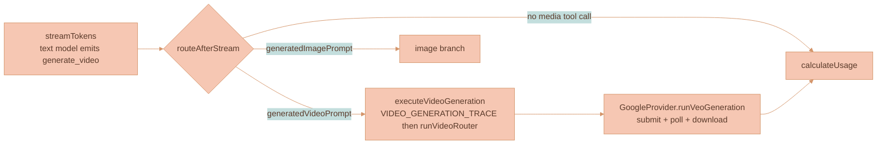
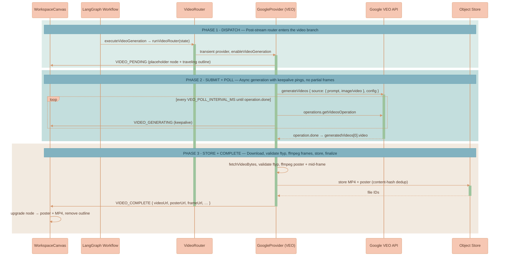

# Video Generation

Video generation is the **video branch** of Lixpi's shared AI generation pipeline. It **extends** [image generation](./IMAGE-GENERATION.md) rather than replacing it: the composer Image/Video sliding switch explicitly selects the media branch, then a user-selected **text model** (Claude, GPT, or Gemini) reads the conversation, including any references, writes a cinematic enhanced prompt, and emits the only media Tool exposed for that mode. The workflow routes the video prompt to an independently selected **video model** (Google Veo 3.1 or BytePlus Seedance 2.x) and stores the finished clip as a playable `VideoCanvasNode`.

Structurally, video adds a sibling to every image primitive: a `generate_video` tool mirroring `generate_image`, a `VideoRouter` mirroring `ImageRouter`, a `VideoPublisher` mirroring the image publisher, and a second post-stream branch in the shared graph. The one place it **cannot** mirror image generation is **execution**. VEO is long-running and asynchronous — submit an operation, poll it until done (≈11s–6min), with no partial frames — so the progressive `IMAGE_PARTIAL` streaming model is replaced by a *placeholder + keepalive + `VIDEO_COMPLETE`* model.

This page covers what is specific to video generation. The shared LangGraph workflow, dual-model architecture, post-stream 3-way router, tool injection/extraction mechanism, routers, stream lifecycle, and shared `ProviderState` are covered in [AI Generation Pipeline](../platform/AI-GENERATION-PIPELINE.md).


The shared workflow, dual-model routing, the `generate_video` tool schema, the 3-way `routeAfterStream` router, and the routers live in [AI Generation Pipeline](../platform/AI-GENERATION-PIPELINE.md). Canvas placement, branch lineage, branch-root provenance, balanced branch-tree layout, and VLM reference selection (including which prior generated video continues a branch) live in [Branch Lineage](./BRANCH-LINEAGE.md). A source/uploaded first-frame image is only a reference and placement anchor; it does not become a generated-output connector parent unless it is itself an existing generated-media branch member selected by the API lineage planner. The full stream-event catalog lives in [Streaming and Events](../platform/STREAMING-AND-EVENTS.md). The playback control bar lives in [Video Player Controls](../../packages/lixpi/ui-kit/docs/VIDEO-PLAYER-CONTROLS.md).


## Explicit Media Mode

The composer stores `mediaGenerationMode: image | video` in its ProseMirror node and preserves separate image/video model selections and configuration groups. Only the active mode's model ids and options enter `mediaGenerationRequest`; prompt wording and source-video context cannot switch modes. The bottom summary row is the settings trigger. Its menu shows the reasoning section plus only the active image or video section.

The API model catalog publishes a per-model `mediaGenerationConfigMatrix`. Video controls are copied from `AiModel.videoGenerationControls`, whose authoring source is `services/ai-model-registry/data/model-catalog/`. Each selected model has its own configuration row. Aspect ratio, resolution, duration, and Seedance 2.5 output format use the shared ui-kit sliding dropdown. Seedance `Smart length` is an ordered duration option whose question-mark trigger opens its option description through the shared help tooltip. All Seedance models expose generated audio. Negative prompting, moderation policy, and provider output count remain pipeline-owned. The API validates every submitted value against the same synchronized profile before provider execution.

## Where Video Generation Sits

The video branch is one of the three post-stream destinations in the shared workflow. After the text model streams, the 3-way `routeAfterStream` router sends a request carrying `generatedVideoPrompt` directly to `executeVideoGeneration`, which calls `runVideoRouter` to run a transient VEO provider. The video branch has **no** validate-prompt node — VEO prompts have no strict character limit, so unlike images there is no prompt-rewrite/validation step. The diagram below shows only that slice; the complete graph is in [AI Generation Pipeline](../platform/AI-GENERATION-PIPELINE.md).



## Asynchronous Execution

VEO does not stream pixels. `client.models.generateVideos(...)` returns an **operation**; the provider polls `client.operations.getVideosOperation(...)` until `operation.done`, then downloads the MP4. This submit-and-poll loop runs **synchronously inside the existing LangGraph request** — it reuses the in-process model, the shared `AbortController`, and the request circuit breaker (`LLM_TIMEOUT_MS`, default 20 min; see [AI Generation Pipeline](../platform/AI-GENERATION-PIPELINE.md)). Because the request now occupies a worker for minutes with **no token traffic**, the poll loop publishes a `VIDEO_GENERATING` keepalive every `VEO_POLL_INTERVAL_MS` (default `10000` ms) so the browser never looks frozen.



## Video `ProviderState` Fields

The video fields mirror the image fields and use the same **"keep if undefined"** channel reducers in [`state.ts`](../../services/api/src/llm/graph/state.ts). VLM branch resolution is **shared** with image generation, so there is no separate video resolution field. The VLM assigns roles within the explicit reference set, and the resolved first/stop frames are written onto the video conditioning fields below. For multi-model matrix requests the branch resolver runs once in shared preflight, so these conditioning fields reach each fanout child only through the complete resolved patch the orchestrator forwards. Children run with `preflightResolved` and never re-resolve, so omitting a resolved conditioning field from fanout would leave the video model running text-to-video (see [AI Generation Pipeline](../platform/AI-GENERATION-PIPELINE.md)). The shared fields (`workspaceContextSnapshot`, `workspaceContextResolution`, `mediaBranchCandidateSnapshot`, `messages`, `model_version`) are documented in [AI Generation Pipeline](../platform/AI-GENERATION-PIPELINE.md); only the modality-specific fields are listed here.

| Field | Type | Purpose |
|-------|------|---------|
| `enableVideoGeneration` | `boolean` | `true` when the provider is invoked as the video model by `VideoRouter`. |
| `videoModelMetaInfo` | `AiModelMetaInfo` | Video model pricing + metadata (resolved by the gateway). |
| `videoModelVersion` | `string` | Selected video model id (e.g. `veo-3.1-generate-preview`). |
| `videoProviderName` | `ProviderName` | Video model provider (`Google`). |
| `videoAspectRatio` | `string` | `16:9` \| `9:16`. |
| `videoResolution` | `string` | `720p` \| `1080p` \| `4k`. |
| `videoDurationSeconds` | `number` | Selected synchronized duration. VEO 3.1 exposes 4, 6, or 8 seconds; the provider forces 8 for conditioned/high-resolution requests. Seedance 2.0 accepts 4 through 15 and Seedance 2.5 accepts 4 through 30; both support `-1` for intelligent duration. |
| `videoGenerationConfig` | `Partial<Record<MediaGenerationConfigControlKey, string>>` | Validated per-model settings not represented by the legacy scalar aspect/resolution/duration fields. |
| `generatedVideoPrompt` | `string` | Enhanced prompt extracted from the text model's `generate_video` tool call. |
| `generatedVideoNegativePrompt` | `string` | Optional negative prompt produced by the reasoning model and merged into the transient provider configuration. |
| `videoFirstFrameImage` | `string` | VLM-selected first frame, as a data URL (image-to-video). |
| `videoReferenceImages` | `string[]` | VLM-selected style/content references (≤3). |
| `videoSourceForExtension` | `string` | `nats-obj://…` URI of a source MP4 to extend (multi-turn). |
| `isMediaRegenerationRun` | `boolean` | Shared media-regeneration flag. It affects seed selection only for providers that accept a client-supplied seed. |
| `generatedVideos` | `string[]` | Resulting video URLs/ids. |
| `videoUsage` | `VideoUsage` | `{ durationSeconds, resolution, aspectRatio }` for billing, plus optional `completionTokens` / `totalTokens` for token-metered providers (Seedance). |

## The VEO Provider Path

`GoogleProvider.runVeoGeneration` ([`google-provider.ts`](../../services/api/src/llm/providers/google-provider.ts)) runs **only** when `enableVideoGeneration && modelNameImpliesVideoOutput` — a non-VEO Google model never enters this path, and the existing Gemini image branch is untouched.

**Config.** The synchronized Veo 3.1 profiles expose visual `aspectRatio`, per-model `resolution`, and per-model `durationSeconds`. `numberOfVideos` remains fixed at one and output remains MP4. The reasoning model can populate Veo's native `negativePrompt`; an explicit user negative prompt is preserved by the Tool contract, while the shared Veo prompt wrapper still appends its fixed temporal-quality exclusions inline. Veo 3.1 and 3.1 Fast support 720p, 1080p, and 4K while 3.1 Lite omits 4K. The provider forces 8 seconds for frame/reference conditioning and 1080p/4K, forces 720p for extension, and selects `personGeneration` through the registered moderation profile rather than exposing a user safety bypass. The Gemini Developer API generates audio for all active Veo models but rejects both `generateAudio` and `seed`, so the provider does not send either field.

**Input precedence.** Exactly one conditioning input is sent, in this fixed order. The first applicable input wins; the rest are ignored:

| Priority | Input (state field) | VEO parameter | Notes |
|----------|--------------------|---------------|-------|
| 1 | Extension (`videoSourceForExtension`) | `video` | The API authorizes the source video Asset, resolves its canonical/original Blob, and passes the organization Object Store coordinates to the provider adapter. Mutually exclusive with image/references per the API; takes precedence. |
| 2 | First frame (`videoFirstFrameImage`) | `image` | Image-to-video. |
| 3 | Reference images (`videoReferenceImages`, ≤3) | `referenceImages` | Style/content references (`referenceType: 'asset'`). |
| 4 | Text-to-video | — | None of the above set. |

**Submit + poll.** `client.models.generateVideos(...)` returns an operation; the provider loops on `client.operations.getVideosOperation(...)` every `VEO_POLL_INTERVAL_MS`, publishing a `VIDEO_GENERATING` keepalive each tick and honoring the abort signal, until `operation.done`.

**Download.** `fetchVideoBytes` uses inline `videoBytes` (base64) when present, otherwise `client.files.download(...)` to a temp file. `VideoPublisher.complete` validates the ISO base-media `ftyp` box before storing. Poster and representative-frame extraction is requested from the NEX file-conversion workload through `extractVideoFramesViaWorkload`, so ffmpeg work stays out of the API process.

## Seedance 2.x via BytePlus ModelArk

`BytePlusProvider` ([`byteplus-provider.ts`](../../services/api/src/llm/providers/byteplus-provider.ts)) is a first-party peer of `GoogleProvider` that produces video through **BytePlus ModelArk's** official Seedance 2.x API. It is **video-only**: text streaming throws a capability error. It runs **only** when `enableVideoGeneration && /seedance/i.test(modelVersion)`. Everything else is reused unchanged: the same `generate_video` tool, post-stream router, VLM resolver, generated Asset settlement, NEX rendition processing, and `VideoCanvasNode`. The router selects it exactly like VEO (`createTransient(instanceKey, 'BytePlus')`).

**Official route** (overridable via `BYTEPLUS_ARK_BASE_URL`):

- Create: `POST https://ark.ap-southeast.bytepluses.com/api/v3/contents/generations/tasks`
- Retrieve: `GET …/contents/generations/tasks/{id}`
- Auth: `Authorization: Bearer $ARK_API_KEY` (or `BYTEPLUS_ARK_API_KEY`)
- Model ids: `dreamina-seedance-2-0-260128`, `dreamina-seedance-2-0-fast-260128`, `dreamina-seedance-2-0-mini-260615`, and `dreamina-seedance-2-5-260628` (China/Volcengine Ark uses `doubao-*` ids instead).

The typed REST client lives in [`byteplus-video-types.ts`](../../services/api/src/llm/providers/byteplus-video-types.ts) (`createVideoGenerationTask` / `retrieveVideoGenerationTask` / `downloadVideo` over `fetch` + `AbortSignal`, preserving ModelArk `error.code`), with pure `buildSeedanceContent` and an injectable `pollVideoGenerationTask`.

**Config.** Every synchronized Seedance profile exposes adaptive plus the six fixed aspect ratios, generated audio, watermark, and return-last-frame. Seedance 2.0 Standard, Fast, and Mini support 4 through 15 seconds; Standard supports 480p/720p/1080p/4K, while Fast and Mini support 480p/720p. Seedance 2.5 supports 4 through 30 seconds, 480p/720p/1080p, up to 30 reference images, and an MP4/MOV output-format dropdown; frame-conditioned 2.5 requests force `ratio: adaptive` as required by ModelArk. All four models support intelligent `-1` duration. The provider serializes the validated values to `ratio`, `resolution`, `duration`, `generate_audio`, `output_format` where supported, `watermark`, and `return_last_frame`. Current Seedance 2.x models do not accept `seed`, `camera_fixed`, draft mode, or `service_tier=flex`, so the provider sends none of those fields. If ModelArk reports a generated seed in the completed task, Lixpi stores it on the Asset as `lineage.generationSeed`.

**Input precedence.** `content[]` is text-first, then ONE input family — first-frame and reference are mutually exclusive in Seedance, matching VEO:

| Priority | Input (state field) | ModelArk `content[]` item | Notes |
|----------|--------------------|---------------------------|-------|
| 1 | Extension (`videoSourceForExtension`) | — | **Rejected** with a capability error — no provider-fetchable asset handoff yet. Use VEO for extension. |
| 2 | First frame (`videoFirstFrameImage`) | `image_url` `role: first_frame` | Image-to-video. |
| 3 | Reference images (`videoReferenceImages`, ≤9) | `image_url` `role: reference_image` | Already capped to the provider budget by the router. |
| 4 | Text-to-video | — | None of the above set. |

Inputs are base64 data URLs (the resolver already supplies them); private `nats-obj://` URIs are refused before submit so they never reach ModelArk.

For `self` or `authorized-real-person` references, the router first requires a valid BytePlus provider Asset handle in the configured account scope. Missing/expired/revoked handles pause the durable request before submit and expose **Verify with provider** in the planned canvas slot. The provider-hosted H5 flow sends liveness/identity media directly to BytePlus; Lixpi stores only signed-session hashes and the resulting scoped handle. Seedance then receives `asset://<subjectHandle>`. See [Media Reference Identity and Provider Moderation](./MEDIA-REFERENCE-IDENTITY-AND-MODERATION.md#byteplus-native-verification).

**Submit + poll + store.** Publish `VIDEO_PENDING` on accept; poll `GET …/tasks/{id}` every `BYTEPLUS_VIDEO_POLL_INTERVAL_MS` (default = `VEO_POLL_INTERVAL_MS`, 10s), publishing a `VIDEO_GENERATING` keepalive on each non-terminal poll, until `succeeded`/`failed`/`cancelled`/`expired`. On success, **download `content.video_url` immediately** because ModelArk output URLs are cleaned after 24 hours. When `return_last_frame` is enabled, download `content.last_frame_url` too and store the PNG as the Asset's ready `representativeFrame` rendition. `VideoPublisher.complete` validates the MP4/MOV `ftyp` box, stores the provider container with the matching MIME type, and starts the normal rendition pipeline; MOV is transcoded to the canonical MP4. Vendor token usage (`usage.total_tokens`) flows into `videoUsage` for billing.

**Prompt phrasing.** The shared final-prompt wrapper (`buildVideoModelPrompt`) selects a per-provider profile: Seedance uses positive/affirmative phrasing, **omits VEO's inline `Negative prompt:` line** (negative tokens backfire on Seedance — the model renders them), and adds an image-safety context that preserves visible reference characteristics when selected image-conditioned references are generated or visibly stylized canvas media. VEO's emitted prompt is byte-identical. The shared wrapper + profiles are covered in [AI Generation Pipeline](../platform/AI-GENERATION-PIPELINE.md).

## VLM Reference Mapping

The structured VLM resolver itself — candidate snapshots, role assignment, references-vs-lineage, and how a prior **video** node participates by contributing a still — is owned by [Branch Lineage](./BRANCH-LINEAGE.md). The video-specific part is only the **mapping** from the resolver's outcome onto VEO's mutually-exclusive conditioning inputs:

| Resolver outcome | VEO input |
|---|---|
| Target identified (edit / style-transfer / continuation) | `videoFirstFrameImage` → VEO `image` (first frame, image-to-video) |
| No target, references present | `videoReferenceImages` (≤3) → VEO `referenceImages` (`referenceType: 'asset'`) |
| No references | neither set → text-to-video |

VEO's `image` (first frame) and `referenceImages` are **mutually exclusive** per the SDK, so the resolver populates exactly one path. The browser receives the same `MEDIA_BRANCH_RESOLVED` event it already understands for images.

The registered Google profile requires `GOOGLE_VEO_PERSON_GENERATION_PROFILE=standard|restricted`. Standard text/extension requests use `personGeneration: allow_all`; standard image-conditioned and every restricted-profile request use `allow_adult`. Missing profile configuration is a visible configuration failure, not a guessed fallback. Display names remain behind the shared `REFERENCE_n` boundary and Veo rejections are terminal for that paid run.


**Videos are grounded by a single still, never the MP4.** The browser's candidate snapshot includes prior video Assets alongside images, each contributing the `representativeFrame` rendition and falling back to `poster`. An edit therefore continues a previous video branch at the same VLM cost as an image. The full `original` rendition reaches VEO only for explicit extension. The candidate-snapshot mechanics live in [Branch Lineage](./BRANCH-LINEAGE.md).


## Seed inheritance

Seeds are provider state, not a composer control. Stability is the active provider that accepts a client-supplied seed. `BaseProvider.resolveGenerationSeed` applies this rule:

1. Read the pending Asset's lineage and walk its `parentAssetId`, then its `sourceAssetIds` in recorded order.
2. Reuse the first `lineage.generationSeed` found, so a branch continued for editing or a prompt that references an earlier generated Asset lands near that output.
3. Skip an inherited seed that falls outside the target provider's accepted range, which is how a seed recorded by one provider can never be rejected by another.
4. Generate a fresh seed when nothing in the lineage carries one.

Regeneration is the deliberate exception. A regeneration run carries `isMediaRegenerationRun`, set by the media routers from the lineage plan's `regenerationTarget`, and always gets a fresh seed on providers that accept one. Reusing the source seed there would return the output the user just asked to redo.

A lineage read failure never blocks generation; the provider logs it and falls back to a fresh seed.

The active Google and BytePlus video paths do not send a seed. BytePlus may still report the provider-generated seed on completion, and Lixpi stores that reported value without trying to reuse it in a later request.

## Storage & Durability

Video uses the same Asset/Blob contract as every other media kind. The provider MP4 or MOV is the Asset's `original` rendition; MOV receives a canonical MP4 from NEX. NEX writes the remaining `poster` and `representativeFrame` renditions required by the shared matrix unless the provider already supplied the returned last frame. Each rendition points to a SHA-256-addressed Blob in `blobs-{organizationId}-files`. Existing Blob metadata is reused only after its object hash and byte size verify.

**HTTP routes** ([`asset-routes.ts`](../../services/api/src/routes/asset-routes.ts)).

| Route | Behavior |
|-------|----------|
| `GET /api/assets/:assetId/renditions/:renditionName` | Authorizes the Asset, resolves its Blob, and supports **HTTP Range** responses for audio/video playback. |
| `POST /api/assets/workspaces/:workspaceId` | Accepts user uploads, sniffs bytes, creates the Asset and original Blob, and queues required NEX renditions. |

Authentication supports Bearer tokens and `?token=` for browser media element URLs.

**Deletion.** Removing a canvas node atomically removes that node's Workspace reference. Catalog references and placements are independent references to the same Asset. Only a zero-reference Asset enters maintenance deletion; maintenance removes rendition Blob references, and zero-reference Blobs are garbage-collected after object verification.

## The `VideoCanvasNode`

Generated videos persist as a discriminated member of the `CanvasNode` union (`type: 'video'`). The canvas node is a placement that points to an Asset; media facts and bytes do not live in `canvasState`.

| Field | Type | Purpose |
|-------|------|---------|
| `nodeId` | `string` | Stable canvas identity. |
| `type` | `'video'` | Discriminant in `CanvasNode` / `CanvasNodeType`. |
| `assetId` | `string` | Stable Asset identity used to resolve playback, poster, metadata, lineage, and provenance. |
| `position` / `dimensions` | `{x,y}` / `{w,h}` | Canvas geometry. |
| `generatedBy` | `VideoGeneratedByMetadata?` | Provenance + branch lineage (mirrors `ImageGeneratedByMetadata`, adds `videoModel`, `resolution`, `durationSeconds`, `veoOperationName`, `sourceVideoNodeId`). |

Aspect ratio, duration, audio presence, original name, rendition readiness, and descriptor live on the Asset. The UI joins the node with `assetsStore` and never persists rendition URLs.

## Video-Specific Stream Nuances

Video events use the same live per-thread receive subject as the rest of the AI pipeline and are also persisted to the chat pipeline replay log. Trace/final generated-video transcript nodes are mirrored into the authoritative ProseMirror step stream, so branch-marker and generated-media provenance panels can recover after refresh. The complete catalog and replay behavior are owned by [Streaming and Events](../platform/STREAMING-AND-EVENTS.md). The table below is only the video-specific nuance - how the video lifecycle differs from the image lifecycle, which is the core consequence of VEO being async with no partial frames.

| Status | Video-specific nuance |
|--------|-----------------------|
| `VIDEO_GENERATION_TRACE` | Tool prompt plus explicit reference roles, published **before** VEO runs so chat history can render the trace even if VEO later fails. |
| `VIDEO_PENDING` | Creates the placeholder `VideoCanvasNode` and starts the traveling outline — the video analogue of an empty `IMAGE_PARTIAL`, but there is exactly **one** placeholder event, not a partial stream. |
| `VIDEO_GENERATING` | Pure keepalive ping during the poll loop. There is **no image-side equivalent** — images stream real partial pixels; VEO has no partial frames, so this carries no payload and only proves the worker is alive. |
| `VIDEO_COMPLETE` | Carries `videoUrl`, `assetId`, media facts, provenance fields, and API-authored `canvasGeometry`. Playback and grounding resolve named renditions from the Asset. |
| `VIDEO_ERROR` | Surfaces the provider failure. The API removes only that run's pending node and publishes authoritative replacement geometry; the browser never persists failure cleanup from a potentially stale canvas snapshot. Because the trace was published first, the failed attempt still leaves an auditable record in chat. |

The relevant public subject group in [`nats-subjects.json`](../../packages/lixpi/constants/nats-subjects.json) is Asset-centric; internal rendition request/reply subjects are not browser permissions:

```jsonc
"ASSET_SUBJECTS": {
  "GET": "asset.get",
  "ATTACH": "asset.attach",
  "DETACH": "asset.detach"
}
```

The `CHAT_SEND_MESSAGE` payload gains `aiVideoModel`, `videoAspectRatio`, `videoResolution`, `videoDuration`, and `videoSourceForExtension`. The gateway (`ai-interaction-subjects.ts`) resolves `aiVideoModel` (`Provider:model`) to `videoModelMetaInfo`, normalizes the requested video params against the synced model option lists, and forwards the selected duration as a number.

## Playback Handoff

On `VIDEO_PENDING`, `WorkspaceCanvas` (`setAiGeneratedVideoCallbacks`) drops a placeholder `VideoCanvasNode` near the API-declared lineage source or reference group with a traveling progress outline; on `VIDEO_COMPLETE` it upgrades the node to poster + MP4 with `generatedBy` lineage and removes the outline; on `VIDEO_ERROR` it cleans up. Reference/style/source media can anchor placement and animate while generation prepares, but they do not become connector parents unless the API lineage plan selected an existing generated-media branch member as `parentMediaNodeId` (see [Branch Lineage](./BRANCH-LINEAGE.md)). The in-chat `aiGeneratedVideoNode` mirrors the generated-image node, showing pending / keepalive / playable / error states while the `<video_prompt>` text streams.

Completed playback is **browser-composited**: a finished video plays inline through a visible DOM `<video>` element that `WorkspaceCanvas.ts` moves into the transformed video chrome layer, above the PIXI poster. PIXI owns the poster/placeholder behind the node for stable canvas geometry and initial paint, but playback, seeking, fullscreen, and scrubbing are driven by the browser-composited element. The bubble menu exposes Asset details, extension, connection, download/replace, and deletion actions.

Matrix child video lifecycle events are mirrored onto the live canonical response stream as well as the shared ProseMirror assembler, so `VIDEO_COMPLETE` and `VIDEO_ERROR` reach the canvas before request-group settlement. The video handler records pending-Asset `poster`/`original` 404s; Asset revision or completion invalidates those failed sources, reapplies them immediately with a new source revision, and remounts the same browser `<video>` element. A completed Seedance/VEO Asset therefore becomes playable without a page refresh or an Asset-ID change.

## Model Sync & Pricing

The registry catalog makes VEO models discoverable:

- A new `video_generation` modality (`{ title: 'Video Generation', shortTitle: 'VID GEN' }`); VEO models carry modalities `['video', 'video_generation']`.
- `fetchGoogleModels` admits active Veo ids, drops dated snapshots, and explicitly filters every shut-down Veo id even if the upstream list endpoint returns one.
- Every VEO profile authors its user-facing `videoGenerationControls` list: aspect ratio plus family-specific resolution and duration. Audio, MP4 output, one output, request-derived native negative prompting, and people policy remain provider-managed.
- **Per-second pricing** on `AiModel.pricing.video` (`{ measuringUnit: 'seconds', pricePer: '1', price }`). Current prices are **placeholders** to reconcile against [Gemini pricing](https://ai.google.dev/gemini-api/docs/pricing).
- Friendly titles map the three active Veo 3.1 ids to "Veo 3.1", "Veo 3.1 Fast", and "Veo 3.1 Lite".

The API catalog copies those controls into one configuration-matrix group per model. The frontend renders the control kinds without provider logic, and the orchestrator validates submitted values against the selected model's synchronized controls. The video-model selector filters models by the `video_generation` modality and is excluded from the text-model list.

**BytePlus (Seedance) static injection.** BytePlus has no model-list API in the repo, so `synchronizeBytePlusModels` injects the four active Seedance 2.x IDs from BytePlus's current model list: 2.0 Standard, 2.0 Fast, 2.0 Mini, and 2.5. All expose adaptive plus six fixed aspect ratios, intelligent duration, audio, watermark, and returned last frame. Standard exposes 480p/720p/1080p/4K and 4 through 15 seconds; Fast and Mini expose 480p/720p and 4 through 15 seconds; 2.5 exposes 480p/720p/1080p, 4 through 30 seconds, MP4/MOV output, and 30 references. Token-metered pricing remains model/resolution/input-mode specific.

## Usage Metering

`reportVideoUsage` ([`usage-reporter.ts`](../../packages/lixpi/usage-reporter/src/usage-reporter.ts)) branches on `pricing.video.measuringUnit`: `'seconds'` computes per-second cost (VEO, byte-identical to before), `'tokens'` computes `total_tokens × price / pricePer` (Seedance — `total_tokens` threaded from the ModelArk task response through `videoUsage`). It returns a `VideoUsageReport`.


Usage reports are computed and logged today; they are not published to NATS yet. Per-second VEO prices are still placeholders to reconcile; Seedance token pricing follows the Dreamina resource packs.


## Media Library for Video

Videos are first-class Assets in Media Library. Their initial catalog reference is created with the Asset; inserting one adds a Workspace reference. No byte copy or second media record is created. See [Media Library](../library/MEDIA-LIBRARY.md).

| Subject | Handler |
|---------|---------|
| `asset.attach` | Adds a Workspace placement/reference. |
| `asset.detach` | Removes a Workspace placement or catalog reference. |
| `asset.changeScope` | Changes discovery scope without copying bytes. |
| `asset.list` | Lists authorized Asset metadata projections. |

## Multi-Turn Extension

A completed `VideoCanvasNode` can be continued. The browser sends its `assetId` as `videoSourceForExtension`; the API authorizes the Asset, resolves its ready `original` Blob, and converts that internal Blob coordinate to an `nats-obj://` URI for the provider path. Blob coordinates never cross the browser boundary.

## Differences from Image Generation

| Aspect | Image generation | Video generation (VEO) |
|---|---|---|
| Execution | Synchronous / streaming | Async submit + poll, run in-request |
| Progress to UI | `IMAGE_PARTIAL` progressive previews | `VIDEO_PENDING` + `VIDEO_GENERATING` keepalive, no partial frames |
| Payload | base64 PNG/JPEG | multi-MB MP4/MOV (validated by `ftyp`) |
| Prompt display | `>` quote block | `<video_prompt>…</video_prompt>` XML tags |
| Workflow node | `validateImagePrompt` → `executeImageGeneration` | `executeVideoGeneration` (no validate step) |
| Pricing | per-image tiers | per-second (VEO) or per-token (Seedance), via `pricing.video.measuringUnit` |
| HTTP route | whole-object GET | Range-capable GET (seeking) |
| Canvas playback | static texture | PIXI poster behind browser-composited `<video>` + SVG controls |
| Mode/model selection | Explicit Image mode with its synchronized default | Explicit Video mode with its synchronized default |


Branch lineage, branch-root provenance, balanced branch-tree layout, canvas positioning/collision, the generation-trace meta-info renderer, playback controls, and descriptors are **shared**, not differences. Video reuses workspace relevance, the same candidate-snapshot path, branch-tree layout, the collision cleanup pass, the `createImageGenerationTraceDetails` renderer, `components/videoControls`, and the `MediaDescriptor`/`ContentDescriptor` shape used by images. A video candidate simply contributes its mid-frame still instead of a full image. See [Branch Lineage](./BRANCH-LINEAGE.md), [Collision Resolution](../../packages/lixpi/canvas-engine/docs/COLLISION-RESOLUTION.md), [Video Player Controls](../../packages/lixpi/ui-kit/docs/VIDEO-PLAYER-CONTROLS.md), and [Media & Content Descriptors](../ai-chat/MEDIA-DESCRIPTORS.md).


## File Structure

```text
services/api/src/
├── llm/
│   ├── providers/
│   │   ├── base-provider.ts          # routeAfterStream, executeVideoGeneration, VideoPublisher wiring
│   │   ├── google-provider.ts        # runVeoGeneration (submit/poll/download), VEO config + input precedence
│   │   ├── byteplus-provider.ts      # runSeedanceGeneration (ModelArk create/poll/download), video-only
│   │   ├── byteplus-video-types.ts   # typed ModelArk REST client + buildSeedanceContent + pollVideoGenerationTask
│   │   ├── anthropic-provider.ts     # generate_video injection + extraction
│   │   ├── openai-provider.ts        # generate_video injection + extraction
│   │   └── provider-registry.ts      # runVideoRouter dependency and provider constructor map
│   ├── tools/
│   │   ├── video-generation.ts       # generate_video tool def + per-provider extractors
│   │   ├── video-router.ts           # VideoRouter — text model → transient VEO provider
│   │   └── video-generation-trace.ts # VIDEO_GENERATION_TRACE builder
│   ├── graph/
│   │   ├── state.ts                  # ProviderState video fields + VideoUsage
│   │   ├── video-publisher.ts        # VIDEO_PENDING/GENERATING/COMPLETE/ERROR, MP4/MOV validation
│   │   ├── media-branch-resolver.ts  # VLM gate generalized to video; VEO ref mapping
│   │   └── stream-publisher.ts       # videoGenerationTrace()
│   ├── usage/check-metering.ts       # graph run → @lixpi/usage-reporter's admission estimate
│   ├── config.ts                     # VEO_POLL_INTERVAL_MS, BYTEPLUS_ARK_BASE_URL, BYTEPLUS_VIDEO_POLL_INTERVAL_MS
│   └── prompts/
│       ├── load-prompts.ts           # getSystemPrompt(includeVideoGeneration)
│       └── video_generation_instructions.txt
├── services/
│   ├── generated-asset-storage.ts    # settle bytes and attach API-owned canvas projection
│   ├── asset-rendition-service.ts    # request and apply required renditions
│   └── blob-storage.ts               # organization-scoped content-addressed bytes
├── routes/asset-routes.ts            # upload/import + authenticated rendition GET with Range support
└── NATS/subscriptions/
    ├── asset-subjects.ts             # Asset CRUD/reference/scope/document authority
    ├── ai-interaction-subjects.ts    # resolve videoModelMetaInfo + forward video params
    └── media-descriptor-subjects.ts  # authorize Asset and resolve representative rendition

services/web-ui/src/
├── canvas-adapters/workspace-media.ts # authenticated source, upload and download ports
└── services/ai-interaction-service.ts # VIDEO_* handlers to conversation segments

packages/lixpi/canvas-components-lixpi-specific/src/frontend/
├── workspace/workspace-canvas.ts     # product composition and lifecycle
├── media/workspace-media-layer.ts    # video state and poster projection
├── media/workspace-video-chrome.ts   # UI-kit controls on native playback
└── menus/canvas-bubble-menu-items.ts  # video actions

packages/lixpi/canvas-components/src/frontend/media/
└── playback-node.ts                  # reusable poster and native playback surface

packages/lixpi/ui-kit/src/components/videoControls/
                                      # shared SVG playback controls

packages/lixpi/constants/
├── ts/types.ts                       # VideoCanvasNode, VideoGeneratedByMetadata, Asset, Blob, AiModel video fields
├── ai-interaction-constants.json     # VIDEO_* statuses
└── nats-subjects.json                # Asset and internal rendition subjects
```

## References

### Vendor docs (Google)

- Veo 3.1 video generation: https://ai.google.dev/gemini-api/docs/veo
- VEO dialogue example: https://ai.google.dev/gemini-api/docs/veo?example=dialogue
- Veo 3.1 announcement: https://developers.googleblog.com/introducing-veo-3-1-and-new-creative-capabilities-in-the-gemini-api/
- Gemini API pricing: https://ai.google.dev/gemini-api/docs/pricing

### Vendor docs (BytePlus ModelArk — Seedance)

- Create video generation task: https://docs.byteplus.com/en/docs/ModelArk/1520757
- Retrieve video generation task: https://docs.byteplus.com/en/docs/ModelArk/1521309
- Active model list: https://docs.byteplus.com/en/docs/ModelArk/1330310
- Online inference pricing: https://docs.byteplus.com/en/docs/ModelArk/1099320
- Dreamina Seedance 2.0 tutorial: https://docs.byteplus.com/en/docs/ModelArk/2291680
- Seedance 2.0 prompt guide: https://docs.byteplus.com/en/docs/ModelArk/2222480
- Resource packs (pricing): https://docs.byteplus.com/en/docs/ModelArk/2191775

## Related Pages

- [AI Generation Pipeline](../platform/AI-GENERATION-PIPELINE.md) — the shared LangGraph workflow, dual-model routing, the `generate_video` tool mechanism, the 3-way `routeAfterStream` router, `VideoRouter`, `ProviderState`, and the stream lifecycle.
- [Image Generation](./IMAGE-GENERATION.md) — the sibling image branch this pipeline extends.
- [Branch Lineage](./BRANCH-LINEAGE.md) — canvas placement, branch identity, branch-root provenance, balanced branch-tree layout, and the structured VLM resolver (including how a prior video continues a branch via its mid-frame still).
- [Streaming and Events](../platform/STREAMING-AND-EVENTS.md) — the complete stream-event catalog and the browser render path.
- [Video Player Controls](../../packages/lixpi/ui-kit/docs/VIDEO-PLAYER-CONTROLS.md) — the shared SVG playback control bar and its two mount points.
- [Media Library](../library/MEDIA-LIBRARY.md) — saving and materializing reusable video copies.
- [Rendering Engine](../../packages/lixpi/canvas-engine/docs/RENDERING-ENGINE.md) — the PIXI media layer and DOM chrome overlay that render video nodes.
- [Media & Content Descriptors](../ai-chat/MEDIA-DESCRIPTORS.md) — the VLM analysis descriptor generated videos request from their representative still/poster.
