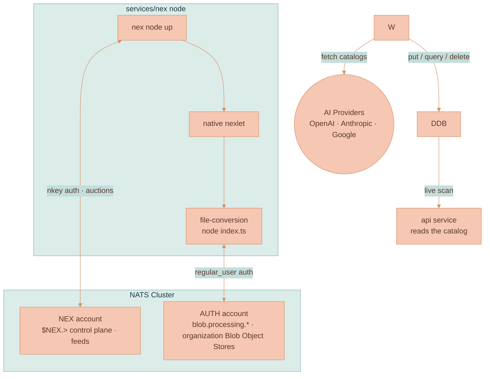

# NEX Execution Engine

Lixpi runs background work on the same bus everything else runs on. A [NATS NEX](https://github.com/synadia-io/nex) **node** — the `services/nex` service — connects to the NATS cluster as a client and supervises long-running service workloads.

This page documents the Lixpi deployment and operation of that node. For how NEX itself works — nodes, nexlets, workloads, the Nexfile, the real container/Docker story — see [NATS NEX Execution Engine — How It Works](../../knowledge/NATS-NEX-EXECUTION-ENGINE-EXPLAINED.md). The node's operator guide lives in the [`services/nex` README](../../../services/nex/README.md), and the resource definitions are in [`services/nex/`](../../../services/nex) and [`infrastructure/pulumi/src/resources/nex-node/nex-node.ts`](../../../infrastructure/pulumi/src/resources/nex-node/nex-node.ts).

## What runs here

| Workload | Type · lifecycle | What it does |
|----------|------------------|--------------|
| `file-conversion` | `native` · `service` | Responds on active `blob.processing.generateRenditions`. It runs sharp/ffmpeg/libreoffice/poppler outside the API, reads organization Blob coordinates, and writes immutable canonical/preview/thumbnail/poster/representative-frame objects without DynamoDB access. |
| `system-reporter` | `native` · `service` | A trivial smoke-test workload (echoes uptime every 30s). Deployed by hand to prove the substrate. |

The model catalog is not here. [`services/ai-model-registry`](../../../services/ai-model-registry) owns it and writes `AI_MODELS_LIST` on its own hourly loop.



## The node, the nexlet, the workload

Three primitives, all on NATS:

- A **node** (`nex node up`) connects to NATS, runs placement auctions, and supervises workloads. It is a NATS *client* of the existing cluster, not another server.
- A **nexlet** is the runtime agent that executes a workload. NEX bundles one — the **native** nexlet, which runs an OS executable. (Containers, VMs, and WASM are a documented Go-SDK extension point, not something this node needs.)
- A **workload** is the unit of execution. Lixpi workloads here are `native` `service` processes: the native nexlet launches `node --experimental-transform-types index.ts` and keeps each responder/loop running.

The depth — auctions, the Nexfile schema, every way to run NEX — is in the [knowledge doc](../../knowledge/NATS-NEX-EXECUTION-ENGINE-EXPLAINED.md).

## Startup and workload loops

The container entrypoint ([`services/nex/entrypoint.sh`](../../../services/nex/entrypoint.sh)) does four things on boot:

1. `pnpm install` — resolves the workload's `@lixpi/*` and provider-SDK dependencies from the pnpm workspace, the same way the `api` container does.
2. `nex node up` — connects to the NATS `NEX` account with the node nkey and starts the native nexlet, in the background.
3. Deploys service workloads — builds each workload start-request and runs `nex workload start`, retrying until the node is accepting auctions.
4. Supervises the node in the foreground.

The file-conversion workload ([`workloads/file-conversion/index.ts`](../../../services/nex/workloads/file-conversion/index.ts)) is a NATS responder. It subscribes to:

- `blob.processing.generateRenditions` verifies tenant bucket/source SHA-256 coordinates, reads and writes only organization Blob-bucket objects, produces the complete per-media rendition matrix, and returns per-rendition success or stable failure codes through the requester's NATS reply inbox.

NEX has no Asset DynamoDB authority. The API re-reads and hashes every returned object, registers Blob rows/references, and updates Asset state transactionally.

The workload connects as the AUTH-account `regular_user`, not with the NEX-account workload credentials, because organization Blob Object Store buckets live in the AUTH account. The NEX node still supervises the process; the file bytes never cross the NEX control account.

## The NEX account and credentials

The node authenticates into a dedicated **`NEX`** account in [`services/nats/nats-server.conf`](../../../services/nats/nats-server.conf), separate from the `AUTH` account that carries app traffic. It connects with a user nkey (`NATS_NEX_NODE_NKEY_SEED`/`_PUBLIC`, generated by the env setup alongside the other NATS keys) and uses that same nkey to mint scoped credentials for the nexlet and workloads.

NATS runs centralized auth callout, so static config-file users are not the effective verifier for NEX. The API auth callout receives the NEX client's raw `nkey` + `sig` challenge response, verifies it against `NATS_NEX_NODE_NKEY_PUBLIC`, and returns a NATS user JWT whose audience is the `NEX` account.

Credential ownership is intentionally split:

- `NATS_NEX_NODE_NKEY_SEED` is a secret and belongs only to the NEX node runtime.
- `NATS_NEX_NODE_NKEY_PUBLIC` is not a secret. The NEX node uses it as the public half of its NATS client credential, the NATS server config lists it so the server advertises the nonce required by native NKey auth, and the API uses it as verification material in `serviceAuthConfigs`.
- The NATS server's static nkey user entry is not the final authorization decision in this design. It enables the native NKey challenge; the server still delegates the decision to the auth callout, then enforces the returned NATS user JWT.


**The node must be given an issuer nkey.** `nex node up` runs with `--issuer-nkey` / `--issuer-nkey-seed` set to the NEX node nkey. Without an issuer strategy, NEX falls back to a development-only minter that hands out empty credentials — and because the `NEX` account requires nkey auth, the embedded native nexlet's own connection would be rejected and no workload could start.


Keeping the node in its own account means its `$NEX.>` control plane and feeds stay isolated from application subjects. The auth decision still goes through the centralized API callout; the isolation comes from the issued JWT targeting `NEX` with NEX-only permissions. For the conceptual auth model see [Authentication](../AUTHENTICATION.md).

Local private-repo workloads are delivered through the shared Docker volume
`lixpi-nex-workloads`, mounted in the node at `/opt/nex/private-workloads`
read-only. Private repos write native executable artifacts into that volume and
deploy Nexfiles that use `file:///opt/nex/private-workloads/...` URIs. This keeps
the public repo responsible for the NEX substrate while letting private repos
supply private binaries without baking them into the public image.

NEX 0.4.1 also supports `nats://<bucket>/<object>` Object Store artifacts in the
native nexlet, but Lixpi does not use that path with the current `--issuer-nkey`
setup. The `NkeyMinter` supplies NKey credentials, while the native artifact
fetcher opens the Object Store connection with `UserJWTAndSeed`; under
centralized auth callout that produces a connection with no usable token or raw
NKey challenge fields, so the API correctly rejects it. Use the shared volume
path locally unless Lixpi moves to a compatible NATS JWT/operator setup or a
patched NEX artifact fetcher.

## Two things that surprise people


**The workload does not inherit the container environment.** The native nexlet starts the child process with only the environment declared in the workload's start-request — not the node container's env. So the entrypoint injects what each workload needs into the start-request at deploy time: model sync receives `ORG_NAME`, `STAGE`, AWS config, `DYNAMODB_ENDPOINT`, and provider API keys; file conversion receives `NATS_SERVERS`, `NATS_REGULAR_USER_PASSWORD`, `HOME`, and `PATH`. A committed Nexfile can't carry secrets, so it documents the contract while the entrypoint supplies the values.



**NEX has no built-in scheduler, and the node keeps no persisted state.** A workload that wants a schedule implements it in its own wrapper rather than declaring it to NEX. State persistence (`--state kv`) is deliberately off: the entrypoint re-deploys the workloads on every boot (idempotent), so persisting *and* replaying them would start each one twice. One node, one instance of each workload.


## Local development

`docker compose --profile main up` starts the three NATS nodes and then `lixpi-nex-1` (assumes `.env` is symlinked via `./set-env.sh` at the repo root — see `services/nex/README.md`). The node connects over plain `nats://lixpi-nats-*:4222` — the client port is not TLS locally. Watch it with:

```bash
docker logs -f lixpi-nex-1     # node registration + workload deploys
```

The fastest confirmation that rendition processing is live is a processing Asset whose `blob.processing.generateRenditions` request/reply advances it to ready or degraded with validated rendition hashes. Operator commands are in the [`services/nex` README](../../../services/nex/README.md).

## On AWS

Pulumi provisions the node as an internal Fargate service ([`nex-node.ts`](../../../infrastructure/pulumi/src/resources/nex-node/nex-node.ts)), wired in by [`pulumiProgram.ts`](../../../infrastructure/pulumi/src/pulumiProgram.ts):

| Service | CPU | Memory | Subnets | Public IP | Inbound | Scale |
|---------|-----|--------|---------|-----------|---------|-------|
| `nex` | 512 | 1024 MB | Private | no | none (egress-only) | single instance |

The task role carries no DynamoDB grant. The node's workloads reach AWS through the Fargate task-role credentials, which the entrypoint forwards into each start-request through the ECS credential-endpoint variable, and `tables` in [`nex-node.ts`](../../../infrastructure/pulumi/src/resources/nex-node/nex-node.ts) is the binding point if a workload needs one.


**The node connects with `nats://`, not `tls://`.** The NEX node uses the Go NATS client, which treats `tls://` as a hard requirement. The client port is plain, so on AWS the node is pointed at the cluster's internal CloudMap URL (`nats://nats.<cloudmap>.internal:4222`) rather than the `tls://` endpoint the browser-facing API uses. This is the mirror image of the API's [`tls://` reply-path requirement](./NATS-CLUSTER.md).


## Why not EventBridge + Lambda?

A managed cron plus a Lambda is the obvious alternative and costs effectively nothing at this scale. Lixpi avoids it for architectural fit, not price: the platform's stance is that anything expressible as a NATS client should not take on a cloud-vendor function runtime (see [Product Overview](../../PRODUCT-OVERVIEW.md)). NEX puts placement, supervision, and feeds on the bus Lixpi already operates. Lambda would be worth reconsidering only if Lixpi dropped the self-hosted-NATS posture.

## Adding a workload

Add `workloads/<name>/` under `services/nex/` with a thin entrypoint wrapper and a Nexfile, declare any new dependencies in `services/nex/package.json`, and point the entrypoint deploy at it. Heavy Node jobs run as `native` workloads, like the sync. The [`services/nex` README](../../../services/nex/README.md) has the step-by-step.

## Related Pages

| Page | What it covers |
|------|----------------|
| [NATS NEX Execution Engine — How It Works](../../knowledge/NATS-NEX-EXECUTION-ENGINE-EXPLAINED.md) | The general NEX reference: nodes/nexlets/workloads, the Nexfile, every way to run NEX |
| [NATS Cluster](./NATS-CLUSTER.md) | The cluster the node connects to — ports, discovery, TLS, the auth-callout boundary |
| [Infrastructure Overview](./INFRASTRUCTURE-OVERVIEW.md) | The wider AWS topology and the other Fargate services |
| [System Architecture](../SYSTEM-ARCHITECTURE.md) | How the services fit together on the NATS backbone |
