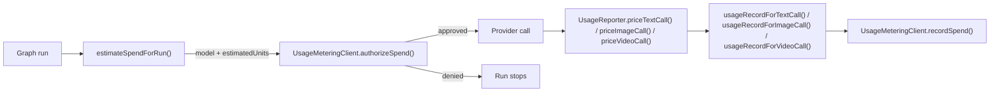

# @lixpi/usage-reporter

Everything Lixpi knows about what a provider call consumed and what it costs. If a number is money, or turns into money, it is defined here and nowhere else.

## Documentation

| Page | What it covers |
|------|----------------|
| [Rates belong to an endpoint](documentation/PRICING-PER-ENDPOINT.md) | Why a model carries no price of its own, where rates live instead, how a lookup picks the right one, and the split between `AiModel` and `PricedAiModel` |
| [Authorizing a spend](documentation/SPEND-AUTHORIZATION.md) | The pre-call estimate: why it is an upper bound, how each modality is counted, the prompt growth margin, and what the log line says |
| [Recording what a call cost](documentation/RECORDED-SPEND.md) | What the reporters measure after a call returns, how reports become usage records, and the token invariants the backend prices against |
| [The metering port](documentation/METERING-PORT.md) | The cross-repo wire contract, `UsageMeteringClient`, the environment flags, and what happens when the backend is off or unreachable |
| [Seedance video tokens](documentation/SEEDANCE-VIDEO-TOKENS.md) | The vendor token formula, the provisional frame-size table, and the bias rule any replacement has to keep |

## Why it is one package

Rates used to sit in `@lixpi/constants` next to the model catalog, and the code that read them sat in `services/api`. That put pricing in a package the browser bundle imports, and it split one subject across two services, so a rate could change in one place and be priced in another. Now the catalog says what a model is and this package says what it costs, which also means an `AiModel` from `@lixpi/constants` carries no rates and is safe to hand to the browser as it stands.

## What it owns

| Area | Exports |
|------|---------|
| Rates on the model | `pricingForCalledInferenceProvider`, `inferenceProviderCalledByThePlatform`, `withoutInferenceProviderPricing`, `AiModelPricing`, `PricedAiModel` |
| Spend estimate | `estimateSpendForRun`, `SpendEstimate`, `SpendEstimateInput`, `SpendEstimateBasis` |
| Metering port | `UsageMeteringClient`, `usageMeteringOptionsFromEnv`, and the wire contract types |
| Measured usage | `UsageReporter`, `TextCallSpend`, `ImageCallSpend`, `VideoCallSpend` |
| Wire mapping | `usageRecordForTextCall`, `usageRecordForImageCall`, `usageRecordForVideoCall` |
| Logging | `logSpendAuthorization`, `logRecordedSpend` |
| Video token math | `estimateVideoTokens` |
| Fixed values | `METRICS_CURRENCY`, `MICRO_DOLLARS_PER_USD`, `UNMEASURED_PROMPT_GROWTH_FACTOR` |

## The two halves of a paid call

Every paid provider call is admitted before it runs and charged after it returns.



Authorization reserves an upper bound; the recorded spend charges what actually happened. Lixpi sends unit counts on both, never money, because the hosted metering backend owns pricing on that wire. The rates in this package are what Lixpi paid, used for its own reporting.

## Using it

Estimating a run, where the caller measures its own prompt and this package decides what that number is worth:

```typescript
import { estimateSpendForRun } from '@lixpi/usage-reporter'

const { modality, estimatedUnits, basis } = estimateSpendForRun({
    model: aiModelMetaInfo,
    promptTokensMeasured,
    maxCompletionSize,
})
```

Talking to the metering backend:

```typescript
import { UsageMeteringClient, usageMeteringOptionsFromEnv } from '@lixpi/usage-reporter'

const usageMetering = new UsageMeteringClient(natsService, usageMeteringOptionsFromEnv())
```

With `METRICS_ENABLED` unset, every spend is authorized and recording is a no-op, so the open-source build runs with no metering backend and makes no network call.

In the API, `services/api/src/llm/usage/spend-estimate.ts` is the adapter between a graph run and `SpendEstimateInput`.

## Files

```text
packages/lixpi/usage-reporter/src/
├── index.ts                    # the package surface
├── types.ts                    # priced models, usage counts, ledger events
├── model-pricing.ts            # which endpoint's rates apply, and stripping them
├── constants.ts                # currency, micro-dollars, the prompt growth margin
├── usage-estimator.ts          # the pre-call upper bound
├── usage-metering-contract.ts  # cross-repo wire messages
├── usage-metering-client.ts    # the metering port over NATS
├── usage-reporter.ts           # what a returned call cost
├── usage-event-mapper.ts       # priced calls to usage records
├── usage-log.ts                # one readable line per authorization and record
└── video-token-accounting.ts   # seconds to vendor video tokens
```

## Tests

```bash
docker compose --profile dev --profile main run --rm --no-deps -T \
  lixpi-typescript-test-runner shared usage-reporter
```
