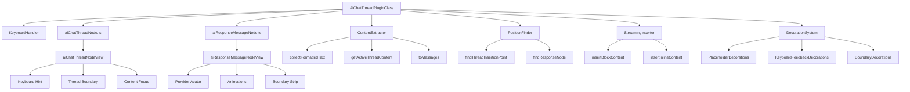
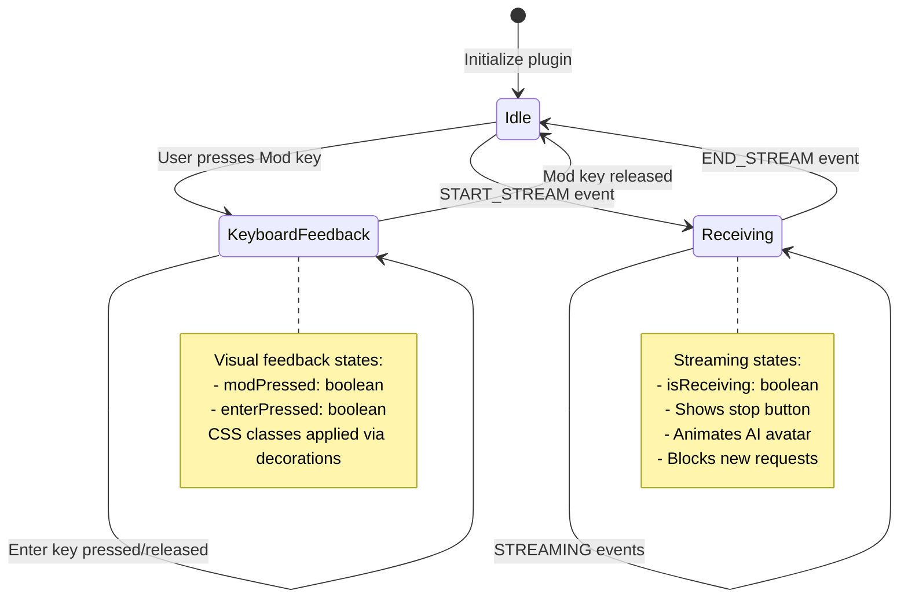
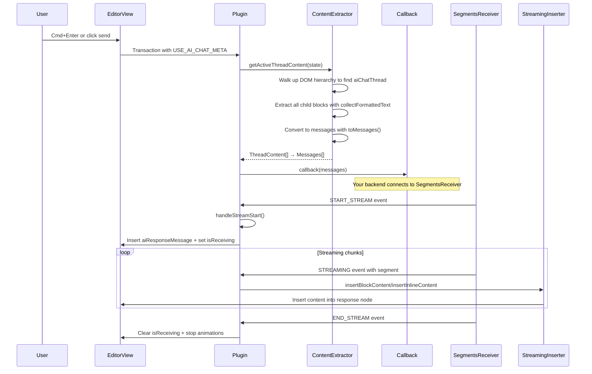
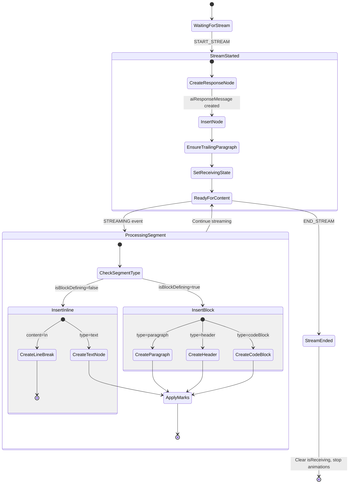
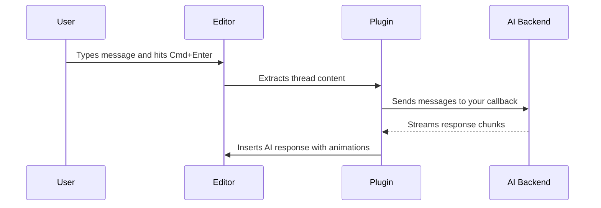
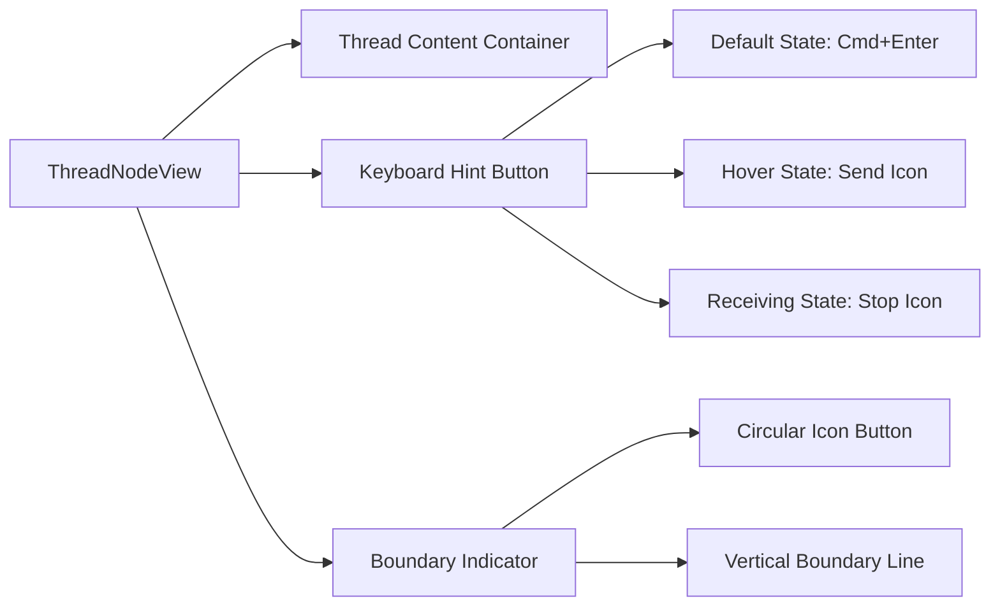
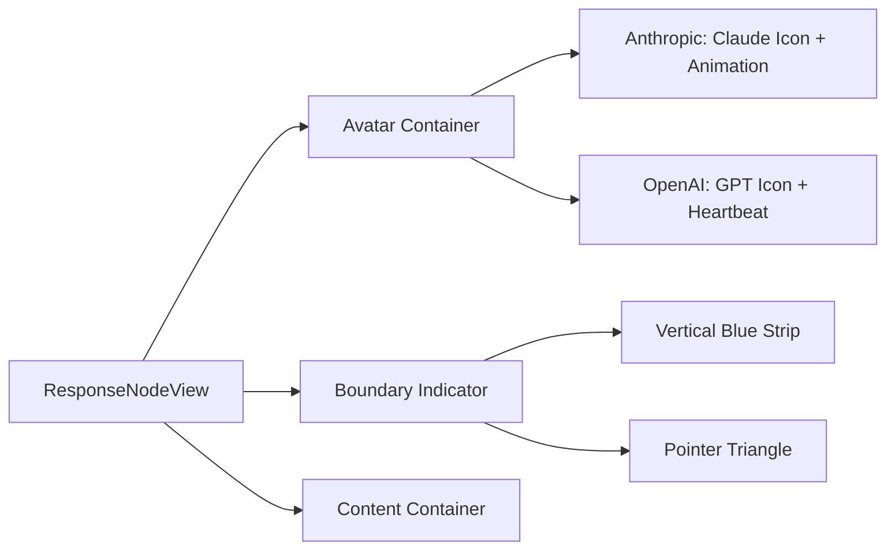

# AI Chat Thread Plugin

Adds ChatGPT-style conversations directly inside ProseMirror documents. Users can type messages, hit Cmd+Enter (or Ctrl+Enter on Windows), and get AI responses streamed back in real-time.

## What it does

This plugin lets you embed chat threads anywhere in a document. Each thread can contain:
- Regular paragraphs (user messages)
- Code blocks (for sharing code)
- AI responses (streamed from your backend)

When a user hits Cmd+Enter or clicks the send button, the plugin:
1. Grabs all the content from the current thread
2. Calls your callback function with the messages
3. Shows streaming AI responses as they come in
4. Handles all the animations and visual feedback

Perfect for documentation with interactive examples, notebooks with AI assistance, or any app where you want conversational AI embedded in rich text.

## Technical Architecture

The plugin follows a modular architecture where each node type encapsulates its own UI and behavior:



**Key Design Principle:** Each node type is fully self-contained:
- `aiChatThreadNode.ts` - Exports both the node spec AND its NodeView (handles keyboard hint, boundary indicator, focus)
- `aiResponseMessageNode.ts` - Exports both the node spec AND its NodeView (handles avatar, animations, boundary strip)
- `aiChatThreadPlugin.ts` - Orchestrates streaming, content extraction, and decorations without mixing UI concerns### Plugin State Machine



## Data Flow & Content Extraction



### Schema Nodes

**`aiChatThread`** - Container for entire conversation
- Content: `(paragraph | code_block | aiResponseMessage)+`
- Attributes: `threadId: string | null`, `status: 'active'|'paused'|'completed'`
- DOM: `div.ai-chat-thread-wrapper[data-thread-id][data-status]`

**`aiResponseMessage`** - Individual AI responses
- Content: `(paragraph | block)*` (empty allowed for streaming shell)
- Attributes: `id, style, isInitialRenderAnimation, isReceivingAnimation, aiProvider, currentFrame`
- DOM: `div.ai-response-message[data-ai-provider]`

## Quick setup

```typescript
import { createAiChatThreadPlugin, aiChatThreadNodeSpec, aiResponseMessageNodeSpec } from './aiChatThreadPlugin'

// Add to your schema
const schema = new Schema({
  nodes: {
    // ... your other nodes
    aiChatThread: aiChatThreadNodeSpec,
    aiResponseMessage: aiResponseMessageNodeSpec,
  }
})

// Create the plugin
const plugin = createAiChatThreadPlugin(
  async (messages) => {
    // messages = [{ role: 'user', content: 'Hello' }, { role: 'assistant', content: 'Hi!' }]
    // Start your AI streaming here
    // Make sure to emit events to SegmentsReceiver
  },
  {
    titlePlaceholder: 'Untitled',
    paragraphPlaceholder: 'Ask me anything...'
  }
)

// Add to editor
const view = new EditorView(document.querySelector('#editor'), {
  state: EditorState.create({ schema, plugins: [plugin] })
})
```

## Streaming Protocol

The plugin subscribes to `SegmentsReceiver.subscribeToeceiveSegment()` and expects this event structure:

```typescript
type StreamStatus = 'START_STREAM' | 'STREAMING' | 'END_STREAM'
type SegmentEvent = {
  status: StreamStatus
  aiProvider?: string  // 'Anthropic' | 'OpenAI'
  segment?: {
    segment: string           // The actual text content
    styles: string[]          // ['bold', 'italic', 'code', 'strikethrough']
    type: string             // 'paragraph' | 'header' | 'codeBlock' | 'text' | 'linebreak'
    level?: number           // 1-6 for headers
    isBlockDefining: boolean // true = new block, false = inline content
  }
}
```

### Streaming Lifecycle



**Content Type Handlers:**
- `paragraph` - Creates paragraph node with text and marks
- `header` - Creates heading node with specified level (1-6)
- `codeBlock` - Creates code_block node
- `text` - Inserts text with styling marks
- `linebreak` - Inserts hard_break or new paragraph

## User experience



Users see:
- A floating "send" button that appears on hover
- Keyboard shortcuts (Cmd/Ctrl + Enter) with visual feedback
- Thread boundaries when hovering (shows conversation scope)
- Different avatars for different AI providers
- Smooth animations as responses stream in
- A "stop" button while AI is responding (currently TODO)

## Files in this plugin

- `aiChatThreadNode.ts` - Thread container node (self-contained):
  - Exports node schema AND its NodeView implementation
  - Handles keyboard hint UI (⌘⏎ to send)
  - Creates thread boundary indicator
  - Manages content focus

- `aiResponseMessageNode.ts` - AI response node (self-contained):
  - Exports node schema AND its NodeView implementation
  - Animated provider avatar with state management
  - Provider-specific rendering (e.g., different icons)
  - Boundary strip decoration

- `aiChatThreadPlugin.ts` - Main orchestration logic:
  - Plugin state and lifecycle management
  - SegmentsReceiver integration for streaming
  - Content extraction and formatting
  - Decoration system (placeholders, boundaries)
  - Keyboard event handling
  - No UI rendering - delegates to node-specific NodeViews

- `ai-chat-thread.scss` - All the styling and animations
- `index.ts` - Exports everything

**Architecture Note:** Each node type is a complete unit with its own UI. The plugin focuses on coordination and business logic without mixing UI concerns. This keeps the code modular and easy to understand!

## Core Helper Classes

### ContentExtractor
Handles thread content analysis and message conversion:

```typescript
class ContentExtractor {
  // Recursively extracts text while preserving code block formatting
  static collectFormattedText(node: PMNode): string

  // Simple text extraction fallback
  static collectText(node: PMNode): string

  // Finds active thread by walking up DOM hierarchy from cursor
  static getActiveThreadContent(state: EditorState): ThreadContent[]

  // Converts thread blocks to AI messages, merging consecutive roles
  static toMessages(items: ThreadContent[]): Array<{ role: string; content: string }>
}
```

**Message Conversion Logic:**
1. Walk each top-level block in the thread
2. Extract formatted text (preserves newlines, wraps code_block in ```)
3. Determine role: `aiResponseMessage` → `assistant`, everything else → `user`
4. Merge consecutive blocks with same role
5. Return clean message array for AI API

### PositionFinder
Document position utilities for content insertion:

```typescript
class PositionFinder {
  // Finds where to insert new aiResponseMessage in active thread
  static findThreadInsertionPoint(state: EditorState): {
    insertPos: number
    trailingEmptyParagraphPos: number | null
  } | null

  // Locates current streaming response node for content insertion
  static findResponseNode(state: EditorState): {
    found: boolean
    endOfNodePos?: number
    childCount?: number
  }
}
```

### StreamingInserter
Handles real-time content insertion during AI streaming:

```typescript
class StreamingInserter {
  // Inserts block-level content (headers, paragraphs, code blocks)
  static insertBlockContent(
    tr: Transaction,
    type: string,
    content: string,
    level: number | undefined,
    marks: any[] | null,
    endOfNodePos: number,
    childCount: number
  ): void

  // Inserts inline content (text, marks, line breaks)
  static insertInlineContent(
    tr: Transaction,
    type: string,
    content: string,
    marks: any[] | null,
    endOfNodePos: number
  ): void
}
```

### Plugin State Management

```typescript
type AiChatThreadPluginState = {
  isReceiving: boolean          // True during AI streaming
  insideBackticks: boolean      // Code block parsing state
  backtickBuffer: string        // Code block content buffer
  insideCodeBlock: boolean      // Legacy code parsing
  codeBuffer: string           // Legacy code buffer
  decorations: DecorationSet   // UI decorations
  modPressed: boolean          // Mod key visual feedback
  enterPressed: boolean        // Enter key visual feedback
  hoveredThreadId: string | null // Thread boundary visibility
}
```

**Transaction Metadata:**
- `setReceiving: boolean` - Toggle streaming state
- `modToggle: boolean` - Keyboard feedback
- `enterToggle: boolean` - Enter key feedback
- `hoverThread: string | null` - Thread boundary hover
- `USE_AI_CHAT_META` - Trigger chat submission
- `INSERT_THREAD_META` - Insert new thread

## NodeViews & UI Components

### Thread NodeView
Creates the interactive thread container:



**Behavior:**
- Auto-generates `threadId` if missing via `setNodeMarkup`
- Focuses editor and positions cursor on mousedown
- Hover events dispatch `hoverThread` metadata
- Click handlers for send/stop functionality

### Response NodeView
Renders AI responses with provider avatars:



**Anthropic Animation System:**
- 8-frame sprite animation at 90ms intervals
- Updates `currentFrame` attribute via `setNodeMarkup`
- SVG viewBox manipulation: `0 ${frame * 100} 100 100`
- Automatic cleanup on destroy

## Decoration System

The plugin applies three independent decoration layers:

### 1. Placeholder Decorations
```typescript
// Document title placeholder
if (node.type.name === documentTitleNodeType && node.content.size === 0) {
  decorations.push(Decoration.node(pos, pos + node.nodeSize, {
    class: 'empty-node-placeholder',
    'data-placeholder': this.placeholderOptions.titlePlaceholder
  }))
}

// Thread paragraph placeholder (single empty paragraph only)
if (node.type.name === aiChatThreadNodeType && node.childCount === 1) {
  const firstChild = node.firstChild
  if (firstChild?.type.name === 'paragraph' && firstChild.content.size === 0) {
    // Apply placeholder decoration
  }
}
```

### 2. Keyboard Feedback Decorations
```typescript
// Applied to thread wrappers during key interactions
let cssClass = 'ai-chat-thread-keys-pressed'
if (pluginState.modPressed) cssClass += ' mod-pressed'
if (pluginState.enterPressed) cssClass += ' enter-pressed'
if (pluginState.isReceiving) cssClass += ' receiving'

decorations.push(Decoration.node(pos, pos + node.nodeSize, { class: cssClass }))
```

### 3. Thread Boundary Decorations
```typescript
// Shows boundary line only for hovered thread
if (node.type.name === 'aiChatThread' &&
    pluginState.hoveredThreadId === node.attrs.threadId) {
  decorations.push(Decoration.node(pos, pos + node.nodeSize, {
    class: 'thread-boundary-visible'
  }))
}
```

## CSS Architecture & Styling Hooks

### Thread Wrapper Styles
```scss
.ai-chat-thread-wrapper {
  position: relative;

  // Thread boundary system
  .ai-thread-boundary-indicator {
    position: absolute;
    right: -47px; // Positioned outside content area
    top: -6px;
    width: 32px; height: 32px; // Circular hover area
    cursor: pointer;
  }

  .ai-thread-boundary-indicator-line {
    position: absolute;
    right: -15px; // Aligned with indicator circle
    top: 0; bottom: 0; // Full thread height
    width: 1px;
    background: $steelBlue;
    opacity: 0; transform: scaleY(0); // Hidden by default

    // Triangle pointer using mixin
    @include boundaryPointerTriangle((
      direction: 'right', anchor: 'top',
      horizontalOffset: 0px, verticalOffset: 10px,
      size: 4px, color: $steelBlue
    ));
  }

  // State classes applied via decorations
  &.thread-boundary-visible .ai-thread-boundary-indicator-line {
    opacity: 1; transform: scaleY(1);
  }

  &.receiving .keyboard-shortcut-hint {
    border-color: $redPink;
    background-color: white;

    .shortcut-receiving { opacity: 1; pointer-events: auto; }
    .shortcut-default, .shortcut-hover { opacity: 0; pointer-events: none; }
  }
}
```

### Keyboard Hint Button States
```scss
.keyboard-shortcut-hint {
  position: absolute;
  bottom: -0.75rem; right: 1rem;
  border-radius: 20px;

  // Three overlaid states with z-index layering
  .shortcut-default { z-index: 1; opacity: 1; }
  .shortcut-hover { z-index: 2; opacity: 0; position: absolute; }
  .shortcut-receiving { z-index: 3; opacity: 0; position: absolute; }

  // Icon animation container
  .icons-container {
    width: 36px; height: 20px;
    position: relative; overflow: hidden;

    .send-icon, .stop-icon {
      position: absolute;
      transition: left 300ms; // Slide animation
    }
  }
}
```

### AI Response Styling
```scss
.ai-response-message-wrapper {
  margin: 0; padding: 0.8rem 0 0.7rem;
  position: relative;

  .user-avatar {
    position: absolute;
    left: -55px; bottom: 0.01rem;
    width: 21px; height: 21px;
    border-radius: 99px;

    &.assistant-anthropic {
      left: -55.5px;
      svg { fill: #D97757; width: 21.5px; height: 21.5px; }
    }

    &.assistant-openai {
      svg { fill: $aiGreen; }
      &.node-receiving-animation svg {
        animation: heartbeatAnimation 1.5s infinite ease-in-out;
      }
    }
  }

  .ai-response-message-boundaries-indicator {
    position: absolute; left: -21px;
    height: 100%; width: $aiResponseMessageIndicatorBoundariesWidth;
    background-color: $aiResponseMessageIndicatorColor;
    border-radius: 100px;

    // Animated entrance
    &.node-render-animation {
      animation: popOutAndGrow 300ms cubic-bezier(0.19, 1, 0.22, 1);
    }

    // Triangle pointer using mixin
    @include boundaryPointerTriangle((
      direction: 'left', anchor: 'bottom',
      horizontalOffset: 0px, verticalOffset: 8px,
      size: 3px, color: $aiResponseMessageIndicatorColor
    ));
  }
}
```

### State-Based CSS Classes

**Applied via decorations:**
- `.ai-chat-thread-keys-pressed` - Base keyboard feedback class
- `.mod-pressed` - When Cmd/Ctrl held down
- `.enter-pressed` - When Enter pressed while Mod held
- `.receiving` - During AI streaming (red stop button)
- `.thread-boundary-visible` - Shows boundary line for hovered thread

**Applied via NodeViews:**
- `.node-render-animation` - Initial appearance animation
- `.node-receiving-animation` - Avatar animation during streaming

## Implementation Details & Edge Cases

### Thread Selection Algorithm
```typescript
// ContentExtractor.getActiveThreadContent() implementation
static getActiveThreadContent(state: EditorState): ThreadContent[] {
  const { $from } = state.selection
  let thread: PMNode | null = null

  // Walk up DOM hierarchy to find containing aiChatThread
  for (let depth = $from.depth; depth > 0; depth--) {
    const node = $from.node(depth)
    if (node.type.name === aiChatThreadNodeType) {
      thread = node; break
    }
  }

  if (!thread) return [] // No active thread = no-op

  // Extract all child blocks...
}
```

**Critical:** Cursor must be inside a thread for extraction to work. Plugin silently does nothing if cursor is outside all threads.

### Response Node Targeting
```typescript
// PositionFinder.findResponseNode() - LIMITATION
static findResponseNode(state: EditorState) {
  state.doc.descendants((node, pos) => {
    if (node.type.name === aiResponseMessageNodeType) {
      // Returns FIRST match in entire document
      endOfNodePos = pos + node.nodeSize
      found = true
      return false // Stop searching
    }
  })
}
```

**Issue:** Multiple concurrent streams will target the first `aiResponseMessage` globally, not scoped to active thread. For multi-thread documents, scope the search to the active thread container.

### Content Formatting Rules
1. **Code blocks** - Wrapped in triple backticks when sent to AI:
   ```typescript
   if (block.type.name === 'code_block' && !textContent.includes('```')) {
     textContent = `\`\`\`\n${textContent}\n\`\`\``
   }
   ```

2. **Hard breaks** - Converted to `\n` in message content
3. **Role merging** - Consecutive blocks with same role merged with `\n` separator
4. **Empty blocks** - Filtered out (no text content)

### Threading & Async Gotchas

**Thread ID Generation:**
```typescript
// aiChatThreadNode.ts - async ID assignment
if (!node.attrs.threadId) {
  const newThreadId = `thread-${Date.now()}-${Math.random().toString(36).substr(2, 9)}`
  setTimeout(() => {
    const tr = view.state.tr.setNodeMarkup(pos, undefined, {
      ...node.attrs, threadId: newThreadId
    })
    view.dispatch(tr)
  }, 0) // Async dispatch can cause re-render flicker
}
```

**Animation State Management:**
```typescript
// aiResponseMessageNodeView.ts - Anthropic frame animation
setInterval(() => {
  const newFrame = (node.attrs.currentFrame + 1) % totalFrames
  // HACK: Updates node attribute to trigger re-render
  view.dispatch(view.state.tr.setNodeMarkup(getPos(), null, {
    ...node.attrs, currentFrame: newFrame
  }))
}, 90) // 90ms frame rate
```

### Unimplemented Features
- **Stop streaming** - Button exists but TODO functionality
- **Multiple concurrent streams** - Response targeting needs scoping
- **Retry failed streams** - No error handling for failed segments
- **Stream resume** - No persistence if browser refreshes mid-stream

## Extending it

Want more content types? Add cases to `StreamingInserter.insertBlockContent()`:

```typescript
case 'blockquote': {
  const textNode = tr.doc.type.schema.text(content)
  const quoteNode = tr.doc.type.schema.nodes.blockquote.createAndFill(null, textNode)
  tr.insert(insertPos, quoteNode)
  break
}
```

Want different AI providers? Add them to `aiResponseMessageNodeView()`:

```typescript
case 'Cohere':
  userAvatarContainer.innerHTML = cohereIcon
  break
```

The styling system uses SCSS variables like `$steelBlue` and `$redPink`. Check `ProseMirrorMixings.scss` for the full list.

## Debug mode

There's a debug flag at the top of the plugin:
```typescript
const IS_RECEIVING_TEMP_DEBUG_STATE = false
```

Set it to `true` to keep the "receiving" state active so you can inspect the CSS without needing to trigger actual AI responses.

---

That's the plugin! It's pretty complex but handles a lot of edge cases around cursor positioning, content extraction, and smooth streaming UX. The hardest part is usually getting the streaming events from your AI backend wired up correctly.