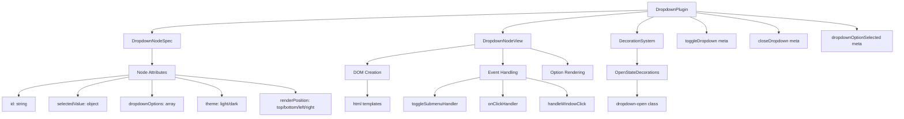
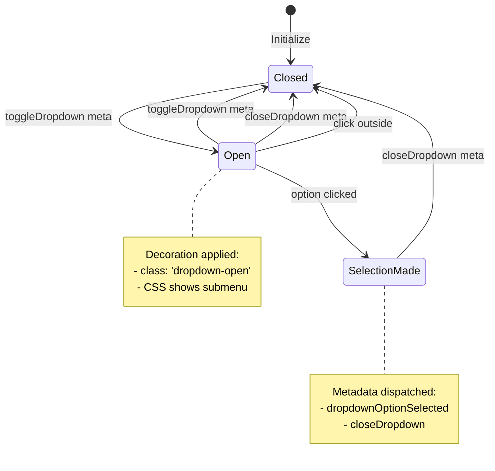

# Dropdown Primitive Plugin

A generic dropdown node primitive for ProseMirror that provides reusable dropdown functionality with decoration-driven open/close state management. Used throughout the editor for AI model selection, theme switching, and other contextual menus.

## What it does

This plugin provides a fully functional dropdown node that can be embedded anywhere in a ProseMirror document. Each dropdown includes:
- A button with customizable icon, title, and selected value display
- A collapsible submenu with configurable options
- Click-outside-to-close behavior
- Decoration-based open/close state management
- Full keyboard and mouse interaction support
- Theme support (light/dark)
- Configurable positioning (top/bottom/left/right)

When a user clicks the dropdown button, the plugin:
1. Toggles the dropdown open state via transaction metadata
2. Updates decorations to show/hide the submenu
3. Handles option selection with customizable callbacks
4. Provides event metadata for parent plugins to handle selection logic

Perfect for AI model selectors, settings menus, or any contextual choice interface that needs to be embedded directly in rich text content.

## Technical Architecture

The dropdown primitive follows the standard ProseMirror plugin pattern with decoration-driven state management:



**Key Design Principles:**
- **Stateless NodeView:** All persistent state lives in plugin state, not in the NodeView
- **Decoration-driven:** Open/close visual state controlled entirely via CSS classes from decorations
- **Event metadata:** Selection events dispatched as transaction metadata for parent plugins to handle
- **Self-contained:** No external dependencies beyond standard ProseMirror and our DOM templates
- **Reusable:** Generic enough to be used by any plugin that needs dropdown functionality

## Plugin State & Event Flow

The dropdown uses a simple state machine managed entirely through transaction metadata:



### Transaction Metadata Events

The plugin responds to and generates these metadata events:

**Input Events (handled by plugin):**
- `toggleDropdown: { id: string }` - Toggle open state for specific dropdown
- `closeDropdown: true` - Close currently open dropdown

**Output Events (generated by NodeView):**
- `dropdownOptionSelected: { dropdownId: string, option: object, nodePos: number }` - User selected an option

## Usage Patterns

### Basic Dropdown Creation

```ts
// In your plugin or NodeView:
const dropdownNode = schema.nodes.dropdown.create({
    id: 'my-dropdown-id',
    selectedValue: {
        title: 'Selected Item',
        icon: someIcon,
        color: '#blue'
    },
    dropdownOptions: [
        {
            title: 'Option 1',
            icon: icon1,
            color: '#red',
            // Custom data fields for your use case
            value: 'option1',
            metadata: { key: 'value' }
        },
        {
            title: 'Option 2',
            icon: icon2,
            color: '#green',
            value: 'option2'
        }
    ],
    theme: 'dark',
    renderPosition: 'bottom',
    buttonIcon: chevronDownIcon
})

// Insert into document
const tr = view.state.tr.insert(pos, dropdownNode)
view.dispatch(tr)
```

### Handling Selection Events

```ts
// In your parent plugin's state.apply:
apply: (tr, prev) => {
    const selection = tr.getMeta('dropdownOptionSelected')
    if (selection && selection.dropdownId === 'my-dropdown-id') {
        const { option } = selection
        // Handle the selection - update stores, trigger actions, etc.
        myStore.setValue(option.value)

        return {
            ...prev,
            // Update your plugin state as needed
        }
    }
    return prev
}
```

### Updating Selected Value

```ts
// To update what's shown as selected:
const pos = findDropdownPosition() // your logic
const currentNode = view.state.doc.nodeAt(pos)
const newAttrs = {
    ...currentNode.attrs,
    selectedValue: {
        title: 'New Selected Item',
        icon: newIcon,
        color: '#purple'
    }
}
const tr = view.state.tr.setNodeMarkup(pos, null, newAttrs)
view.dispatch(tr)
```

## Node Attributes Reference

### Required Attributes

- **`id: string`** - Unique identifier for this dropdown instance. Used to match decorations and events.

### Optional Attributes

- **`selectedValue: object`** - Currently selected item display
  - `title: string` - Text shown in button
  - `icon: string` - SVG string for icon
  - `color: string` - Icon color
- **`dropdownOptions: array`** - List of selectable options
  - Each option: `{ title, icon?, color?, ...customFields }`
- **`theme: string`** - Visual theme: `'light'` | `'dark'` (default: `'dark'`)
- **`renderPosition: string`** - Menu position: `'top'` | `'bottom'` | `'left'` | `'right'` (default: `'bottom'`)
- **`buttonIcon: string`** - SVG string for the dropdown arrow/indicator (default: `chevronDownIcon`)

## Integration with Parent Plugins

### AI Model Selector Example

The AI Chat Thread plugin uses this dropdown for model selection:

```ts
// aiChatThreadNode.ts
function createAiModelSelectorDropdown(view, node, getPos) {
    const dropdownId = `ai-model-dropdown-${node.attrs.threadId}`

    // Transform AI models data into dropdown format
    const options = aiModelsData.map(model => ({
        title: model.title,
        icon: model.icon,
        color: model.color,
        provider: model.provider,  // Custom fields for selection handling
        model: model.model
    }))

    const dropdownNode = view.state.schema.nodes.dropdown.create({
        id: dropdownId,
        selectedValue: currentSelection,
        dropdownOptions: options,
        theme: 'dark',
        renderPosition: 'bottom'
    })

    // Subscribe to documentStore to update selection when model changes
    documentStore.subscribe((store) => {
        const newModel = store?.data?.aiModel
        const newSelected = options.find(opt => `${opt.provider}:${opt.model}` === newModel)
        if (newSelected && newSelected !== currentSelection) {
            updateDropdownSelection(dropdownId, newSelected)
        }
    })
}

// aiChatThreadPlugin.ts - handle selections
apply: (tr, prev) => {
    const selection = tr.getMeta('dropdownOptionSelected')
    if (selection?.dropdownId?.startsWith('ai-model-dropdown-')) {
        const { option } = selection
        if (option?.provider && option?.model) {
            documentStore.setDataValues({
                aiModel: `${option.provider}:${option.model}`
            })
        }
    }
    return prev
}
```

## Styling & CSS Classes

The dropdown generates this DOM structure:

```html
<div class="dropdown-menu-tag-pill-wrapper theme-dark">
    <span class="dots-dropdown-menu">
        <button class="flex justify-between items-center">
            <span class="selected-option-icon flex items-center">
                <!-- Selected item icon -->
            </span>
            <span class="title">Selected Item Title</span>
            <span class="state-indicator flex items-center">
                <!-- Chevron/arrow icon -->
            </span>
        </button>
        <nav class="submenu-wrapper render-position-bottom">
            <ul class="submenu">
                <li class="flex justify-start items-center">
                    <!-- Option icon + title -->
                </li>
                <!-- More options... -->
            </ul>
        </nav>
    </span>
</div>
```

**State Classes:**
- `.dropdown-open` - Applied by decoration when dropdown is open
- `.theme-dark` / `.theme-light` - Theme variants
- `.render-position-{top|bottom|left|right}` - Positioning variants

**CSS Integration:**
```scss
.submenu-wrapper { display: none; }
.dropdown-open .submenu-wrapper { display: block; }
```

## Event Handling Details

### Click Outside Detection

The NodeView automatically handles click-outside-to-close:

```ts
const handleWindowClick = (e) => {
    if (submenuRef && !e.composedPath().includes(submenuRef)) {
        const tr = view.state.tr.setMeta('closeDropdown', true)
        view.dispatch(tr)
    }
}
document.addEventListener('click', handleWindowClick)
```

### Option Selection Flow

1. User clicks option → `onClickHandler` called
2. Handler builds transaction with two metas:
   - `dropdownOptionSelected: { dropdownId, option, nodePos }`
   - `closeDropdown: true`
3. Handler attempts optimistic update via `setNodeMarkup` (immediate UI feedback)
4. Parent plugin receives `dropdownOptionSelected` meta and handles business logic
5. Dropdown plugin receives `closeDropdown` meta and removes decorations

## Error Handling & Edge Cases

- **Missing dropdown plugin:** NodeView gracefully degrades if dropdown plugin not installed
- **Invalid positions:** getPos() validation prevents crashes during rapid updates
- **Rapid clicking:** Event handlers debounced via preventDefault/stopPropagation
- **DOM element cleanup:** All event listeners removed in destroy() method
- **Schema validation:** Node creation wrapped in try/catch with fallback returns

## Performance Considerations

- **Decoration efficiency:** Only creates decorations for actually open dropdowns
- **Event delegation:** Uses single window click listener, not per-option handlers
- **DOM reuse:** NodeView.update modifies existing DOM rather than recreating
- **Memory cleanup:** Subscriptions and listeners properly cleaned up in destroy()
- **Optimistic updates:** Immediate UI feedback via setNodeMarkup before async plugin handling

## Testing & Development

Key scenarios to test when modifying this plugin:

1. **Basic interaction:** Open dropdown, select option, confirm selection updates
2. **Click outside:** Open dropdown, click elsewhere, confirm it closes
3. **Multiple dropdowns:** Multiple dropdowns in same document don't interfere
4. **Rapid interaction:** Fast clicking doesn't cause state corruption
5. **Document updates:** Dropdown survives document mutations and position changes
6. **Theme switching:** Light/dark themes render correctly
7. **Position variants:** Top/bottom/left/right positioning works in all scroll contexts
8. **Memory leaks:** No listeners or subscriptions leak after NodeView destruction

For debugging, temporarily enable console logging in the NodeView event handlers to trace the event flow.

## Related Documentation

- [Main ProseMirror Plugins README](../README.md) - Shared patterns and architecture
- [AI Chat Thread Plugin README](../../aiChatThreadPlugin/README.md) - Usage example
- [DOM Templates Documentation](../../../components/domTemplates.ts) - html() templating system